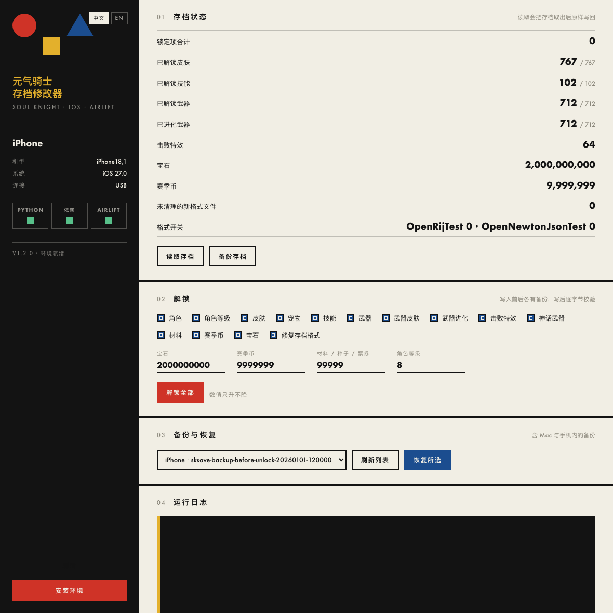

# soulknight-save-editor

通过 AirLift 读写《元气骑士》iOS 本地存档的命令行工具：解锁角色、皮肤、武器、击败特效，
并把宝石、赛季币、材料等数值提到上限。

本工具不含游戏本体，也不修改 App 安装包，只读写运行中 App 的数据容器文件。

实测环境：iPhone（iOS 27.0）＋《元气骑士》8.5.1＋macOS 与完整 Xcode 27。

---

## 中文

### 这是什么

《元气骑士》在 iOS 上的存档位于 App 数据容器里，普通沙箱权限无法访问。本项目基于
[AirLift](https://github.com/0xjohnnydev/airlift)（iOS 27 的 AirTraffic 沙箱逃逸 PoC）
把存档文件取出到 Mac、修改后再写回，并用读回校验确认写入结果。

AirLift 本身只提供「写入一个新文件」这一个原语，所以本工具在它之上实现了两个补充操作：

- **pull**：把已存在的文件/目录移到 Media（AFC 可读区），复制到 Mac，原路径留空；
- **push**：在刚腾空的位置写入新的文件/目录树。

「pull → 本地修改 → push」因此等价于替换文件，也是本工具所有写操作的基础。

### 能改什么

| 项目 | 说明 |
| --- | --- |
| 角色 | 全部解锁（`game.data` 与 plist 双写） |
| 角色皮肤 | 全部解锁，包括 plist 里已存在但未解锁的键 |
| 技能 | 全部解锁 |
| 宠物 | 全部解锁 |
| 角色等级 | 提升到上限 8 |
| 武器 | 图纸状态改为 `Researched`，即武器厅中的已解锁状态；覆盖图鉴表、编号空间与存档里已有的 id |
| 武器进化 | 每把武器写入进化记录并置为已进化，同时补上武器皮肤 |
| 击败特效 | 写入 id 0–63 |
| 宝石 | 默认 2,000,000,000，只升不降 |
| 赛季币 | 默认 9,999,999，只升不降 |
| 材料 / 种子 / 票券 | 默认 99,999，只升不降 |
| 神话武器 | 补齐 0–27 并置为满级 |

每一类都可以单独关闭，具体见「使用」。

### 前置要求

1. **macOS 13 或更高版本**，并安装 **Xcode 27**
   （AirLift 依赖 `xcrun devicectl`，只有完整安装的 Xcode 才提供；仅装 Command Line Tools 不够）。
2. **iPhone 运行 iOS 27**，已与这台 Mac 配对，并已开启
   「设置 → 隐私与安全性 → 开发者模式」。
3. **Python 3.11 或更高版本**，以及 `git`、`make`（`xcode-select --install` 自带）。
4. **游戏必须完全退出**。AirLift 会把存档文件移出容器，App 正在运行会占用这些文件。
5. **建议使用未登录云存档的账号**。若登录过云存档，游戏在下次会话时可能用云端数据覆盖本地修改。

AirLift 不会随仓库分发：`make setup` 会在 `vendor/airlift` 下克隆并编译它（需要联网），
`vendor/` 已被 `.gitignore` 排除。

### 安装

```bash
git clone <仓库地址> soulknight-save-editor
cd soulknight-save-editor
make setup
```

`make setup` 会依次完成：创建 `.venv`、安装 `requirements.txt`、克隆并编译 AirLift、
检查工具链与已配对设备。也可以手动执行：

```bash
python3 -m venv .venv
.venv/bin/python -m pip install -r requirements.txt
.venv/bin/python run.py setup
```

### 使用：应用界面



```bash
make app              # 编译并打开 dist/SoulKnightSaveEditor.app
```

就是一个普通的 macOS 应用窗口，不需要浏览器、也没有本地服务。窗口里可以完成全部操作：
查看设备与运行环境、读取存档状态、备份、逐项勾选要解锁的内容、恢复备份，
运行日志实时显示。环境还没装好时，点左侧的「安装环境」即可，它会创建虚拟环境、
安装依赖并编译 AirLift，进度同样显示在日志里。

界面中英双语，右上角切换。菜单栏里可以「打开工具文件夹」查看取出的存档与备份。

### 使用：命令行

```bash
make devices          # 列出已配对的 iPhone
make info             # 读取存档，只显示状态，不做任何修改
make backup           # 备份存档（Mac 一份，手机 Media 里一份）
make unlock           # 解锁全部内容
```

不使用 `make` 时，命令等价于 `.venv/bin/python run.py <子命令>`：

| 子命令 | 作用 |
| --- | --- |
| `setup` | 克隆并编译 AirLift，检查环境 |
| `devices` | 列出已配对设备（多台设备时用 `--udid` 指定） |
| `info` | 读出存档并打印当前解锁状态 |
| `backup [--label 名字]` | 拉取存档并保存备份 |
| `unlock` | 应用全部修改 |
| `restore --list` | 列出可用的备份（本地与手机内） |
| `restore --from <目录>` | 用本地备份覆盖手机存档 |
| `restore --from-device <Media 路径>` | 用手机 Media 里的备份恢复（容器已空时也可用） |
| `web [--port 端口]` | 打开浏览器界面 |
| 不带子命令 | 进入终端交互菜单 |

`unlock` 的常用开关：

```bash
run.py unlock --gems 999999999            # 指定宝石数量
run.py unlock --no-season-coin --no-gems  # 这两项不动
run.py unlock --no-weapons                # 不改武器
run.py unlock --no-verify                 # 跳过读回校验（更快，不推荐）
```

离线模式：`--offline <存档目录>` 可以对一份已取出的存档副本做同样的修改，不需要连接手机。
该目录需包含 `Documents/` 与 `prefs.plist`；加 `--strip-legacy` 会同时把
`*.data.new` / `*.data.rij` 移到一旁。

### 备份与回滚

修改前会自动做三层保护：

1. `work/live/`：本次拉取的原始文件；
2. `work/backups/before-unlock-<时间>/`：本地备份；
3. `/var/mobile/Media/sksave-backup-before-unlock-<时间>/`：写在手机里的备份，
   即使容器空了也能用 `restore --from-device` 恢复。

写入后会重新把文件取回并逐字节比对；比对不一致会报错并提示用备份恢复。

### 工作原理

1. `xcrun devicectl` 找到设备与 App 数据容器；AFC 用于读写 Media 暂存区。
2. 把 `Documents` 与 `Library/Preferences/...plist` 取出到 Mac。
3. 把 `*.data.new`、`*.data.rij` 移到一旁，并把两个存档格式开关置 0，
   让游戏重新读写经典分片（详见 [docs/SAVE_FORMAT.md](docs/SAVE_FORMAT.md)）。
4. 按分片类型解密（`game.data` 为 XOR，其余为 DES-CBC 或明文），修改字段后原样加密写回。
5. 把整棵目录树与 plist 写回容器，再取回比对一次。

### 目录结构

```
soulknight-save-editor/
├── run.py                  入口（web / 子命令 / 菜单）
├── Makefile                setup / web / info / backup / unlock / test / dmg
├── requirements.txt
├── sksave/
│   ├── ui.html             界面本体（原生窗口内渲染，中英双语）
│   ├── env.py              运行环境状态与安装（只用标准库）
│   ├── device.py           AirLift 设备层：pull / push / Media 读写、编译与设备发现
│   ├── crypto.py           存档加解密（XOR / DES-iambo / DES-crst1 / 明文）
│   ├── workspace.py        本地存档副本与目录枚举（角色、皮肤、武器 id 等）
│   ├── fields.py           字段名、键名规律与「已解锁」取值
│   ├── patcher.py          修改规则
│   ├── session.py          设备流程：拉取、备份、写入、读回校验、恢复
│   └── cli.py              命令行与浏览器界面入口
├── docs/SAVE_FORMAT.md     存档格式与字段说明
├── docs/screenshot-ui.png  界面截图（示例数据）
├── scripts/build_app.sh    用 swiftc 编译 App
├── scripts/build_dmg.sh    打包 DMG
└── tests/                  离线测试（使用合成存档，不含任何真实玩家数据）
```

### 常见问题

**改完进游戏没生效？**
游戏每次会话结束时会把两个格式开关写回 1 并重写新格式分片。重新执行一次 `unlock` 即可，
本工具每次都会重新处理这一步。同时确认游戏在运行前已经完全退出。

**提示 `pull Documents failed` / 找不到容器？**
两种原因，工具都会自动处理并给出提示：一是 iPhone 长时间锁屏后，iOS 会停止交出 App 数据，
解锁手机重跑即可；二是游戏重装或更新后容器路径变了，工具会重新探测并在日志里说明。
首次成功读取后容器路径会记在 `work/container.txt`，所以短暂锁屏不会影响使用。
也可以手动指定 `--container /var/mobile/Containers/Data/Application/<UUID>`。

**卡在 `device_helper` 报错？**
AirLift 的助手偶尔会丢一次响应，本工具会自动重试。持续失败时先确认 Xcode 完整安装
（`xcode-select -p` 指向 `/Applications/Xcode.app/Contents/Developer`）。

**武器或皮肤仍然缺最新的一两个？**
最新内容的 id 可能还没出现在本地存档的图鉴表里。新版本发布后重新运行一次即可覆盖到新编号；
如果确认是新的非数字 id，欢迎提 issue 附上 id。

**会影响云存档吗？**
不影响。本工具只改本地文件。登录过云存档的账号可能被云端覆盖，建议先离线确认效果。

### 打包 DMG

```bash
make dmg            # 先编译 App，再输出 dist/SoulKnightSaveEditor-<版本>.dmg
```

DMG 里是 `.app`、「应用程序」快捷方式和使用说明。首次打开请**右键点 App 选择「打开」**
（未签名应用需要这一步），然后在窗口里点一次「安装环境」，约一到两分钟后即可使用。

App 由 `scripts/build_app.sh` 用 `swiftc` 编译（原生 AppKit 程序），Python 源码随包分发，
首次启动时复制到 `~/Library/Application Support/SoulKnightSaveEditor/tool/`，
运行环境与 AirLift 也建在那里，因此 App 包本身不会被写入，更新或重装都不会丢失状态。
仓库本身仍然是完整、克隆即可运行的。

### 致谢

- [AirLift](https://github.com/0xjohnnydev/airlift)：本工具依赖的沙箱逃逸 PoC，由
  [@0xjohnnydev](https://github.com/0xjohnnydev) 发布，采用 MIT 许可。
  本项目不重新分发它，而是由 `make setup` 在本地克隆编译。
- [soul-knight-data-processing](https://github.com/Matcha-Fan/Soul-Knight-Save-Editor)：
  存档分片与加密算法的参考实现（XOR 密钥、DES 参数与分片列表与之对齐）。
- 目录结构参考了 [@0xjohnnydev](https://github.com/0xjohnnydev) 的 AirCard 项目写法。

### 许可

MIT，见 [LICENSE](LICENSE)。本项目为非官方工具，与凉屋游戏（《元气骑士》）及 Apple 无关联，
也不提供任何担保；请仅在自己的设备与账号上使用。

---

## English

### Overview

A command line editor for the local save files of **Soul Knight** on iOS. It unlocks heroes,
skins, weapons and kill effects, and raises currencies and materials to their caps.

The tool does not contain the game, and does not touch the installed app bundle: it only reads
and writes files inside the app's data container.

Verified on an iPhone running iOS 27.0 with Soul Knight 8.5.1, from macOS with a full Xcode 27.

It is built on [AirLift](https://github.com/0xjohnnydev/airlift), an AirTraffic sandbox escape
for iOS 27. AirLift only offers one primitive, writing a *new* file outside the sandbox, so this
project adds the two operations needed for editing:

- **pull** moves an existing file or directory into Media (which AFC can read), copies it to the
  Mac, and leaves the original path empty;
- **push** writes a fresh file or directory tree at the path that was just vacated.

"pull, edit locally, push" is therefore a file replacement, and everything in this tool is built
on that pair.

### What it unlocks

| Item | Behaviour |
| --- | --- |
| Heroes | All unlocked (written to both `game.data` and the plist) |
| Hero skins | All unlocked, including keys the plist already contains |
| Skills | All unlocked |
| Pets | All unlocked |
| Hero levels | Raised to the cap of 8 |
| Weapons | Blueprints set to `Researched`, which is the state the weapon hall shows as unlocked. Covers the save's own handbook table, the numeric id space and every id already present |
| Weapon evolution | An evolution entry per weapon, marked evolved, with its weapon skins |
| Kill effects | Ids 0–63 |
| Gems | 2,000,000,000 by default; values are never lowered |
| Season coins | 9,999,999 by default; never lowered |
| Materials, seeds, tickets | 99,999 by default; never lowered |
| Mythic weapons | Ids 0–27 topped up and set to max level |

Every category can be disabled individually; see *Usage*.

### Prerequisites

1. **macOS 13 or newer with Xcode 27 installed.** AirLift drives `xcrun devicectl`, which only
   ships with a full Xcode installation; the standalone Command Line Tools are not enough.
2. **An iPhone running iOS 27**, paired with this Mac, with Developer Mode enabled under
   *Settings → Privacy & Security → Developer Mode*.
3. **Python 3.11+**, plus `git` and `make` (both included with `xcode-select --install`).
4. **The game must be fully closed.** AirLift moves files out of the container, so nothing may
   hold them open.
5. **An account that has never used cloud saves is strongly recommended.** If the account is
   linked, the next session may re-upload or overwrite the local save.

AirLift is not redistributed here. `make setup` clones and builds it into `vendor/airlift`
(this needs network access); `vendor/` is listed in `.gitignore`.

### Installation

```bash
git clone <repository url> soulknight-save-editor
cd soulknight-save-editor
make setup
```

`make setup` creates `.venv`, installs `requirements.txt`, clones and builds AirLift, then checks
the toolchain and the paired device. The equivalent manual steps are:

```bash
python3 -m venv .venv
.venv/bin/python -m pip install -r requirements.txt
.venv/bin/python run.py setup
```

### Usage: the app


```bash
make app              # builds and opens dist/SoulKnightSaveEditor.app
```

A plain macOS application window: no browser and no local server. Everything lives in that one
window - devices and environment, the save state, backups, per-category unlock toggles, restoring
a backup - with the log streaming live. If the environment is missing, press "set up" in the left
column and it creates the virtualenv, installs the dependencies and builds AirLift, showing the
progress in the log.

The interface is bilingual (Chinese and English, switchable in the top right corner), and the
menu bar has an "open tool folder" item for the pulled saves and backups.

### Usage: command line

```bash
make devices          # list paired iPhones
make info             # read the save and report its state, changing nothing
make backup           # keep a copy of the save on the Mac and on the phone
make unlock           # apply every unlock
```

Without `make`, the same commands are `.venv/bin/python run.py <subcommand>`:

| Subcommand | Purpose |
| --- | --- |
| `setup` | Clone and build AirLift, then check the environment |
| `devices` | List paired devices (use `--udid` when several are paired) |
| `info` | Read the save and print what is still locked |
| `backup [--label name]` | Pull the save and store a backup |
| `unlock` | Apply all edits |
| `restore --list` | List available backups, local and on-device |
| `restore --from <dir>` | Put a local backup back on the phone |
| `restore --from-device <media path>` | Recover from a backup stored in the phone's Media folder, even when the container is empty |
| `web [--port PORT]` | Open the browser UI |
| no subcommand | Interactive terminal menu |

Useful `unlock` flags:

```bash
run.py unlock --gems 999999999            # pick a gem value
run.py unlock --no-season-coin --no-gems  # leave these two alone
run.py unlock --no-weapons                # skip weapons
run.py unlock --no-verify                 # skip the byte-for-byte read-back (faster, not advised)
```

Offline mode, `--offline <save dir>`, applies the same edits to a copy that was already pulled
from a phone, so no device is needed. The directory must contain `Documents/` and `prefs.plist`;
adding `--strip-legacy` also moves `*.data.new` / `*.data.rij` aside.

### Backups and rollback

Three copies are made before anything is written:

1. `work/live/` - the files exactly as they came off the phone;
2. `work/backups/before-unlock-<timestamp>/` - a local backup;
3. `/var/mobile/Media/sksave-backup-before-unlock-<timestamp>/` - a backup stored on the phone,
   which `restore --from-device` can use even if the container ended up empty.

After writing, the files are pulled again and compared byte for byte. A mismatch is reported as an
error that points at the backup to restore.

### How it works

1. `xcrun devicectl` locates the device and the app data container; AFC is used to read and write
   the Media staging area.
2. `Documents` and `Library/Preferences/...plist` are moved off the phone.
3. Files written in the game's newer format (`*.data.new`, `*.data.rij`) are moved aside and the
   two format switches are set to 0, so the game reads the classic shards again. The details are
   in [docs/SAVE_FORMAT.md](docs/SAVE_FORMAT.md).
4. Each shard is decrypted with the algorithm its file name implies (`game.data` is XOR, most
   others are DES-CBC, a few are plain JSON), edited, and encrypted back.
5. The whole directory tree and the plist are written back, then pulled once more for verification.

### Repository structure

```
soulknight-save-editor/
├── run.py                  entry point (subcommands or menu)
├── Makefile                setup / app / info / backup / unlock / test / dmg targets
├── requirements.txt
├── sksave/
│   ├── ui.html             the interface (rendered in the app window, bilingual)
│   ├── env.py              environment status and setup (standard library only)
│   ├── device.py           device layer: pull, push, Media I/O, build and discovery
│   ├── crypto.py           save ciphers (XOR, DES-iambo, DES-crst1, plain)
│   ├── workspace.py        local save copy and the catalog it enumerates
│   ├── fields.py           field names, key patterns and the "owned" values
│   ├── patcher.py          the edit rules
│   ├── session.py          device flow: pull, back up, push, verify, restore
│   └── cli.py              command line and menu
├── docs/SAVE_FORMAT.md     save layout, ciphers and field semantics
├── docs/screenshot-ui.png  screenshot of the interface, with sample data
├── scripts/build_app.sh    compiles the AppKit app with swiftc
├── scripts/build_dmg.sh    packages the .app into a DMG
└── tests/                  offline tests on a synthetic save, no real player data
```

### Troubleshooting

**The game still shows things as locked.**
The game rewrites both format switches to 1 and regenerates the new-format shards at the end of
every session. Run `unlock` again, and make sure the game was fully closed before the run.

**"pull Documents failed" / no container.**
Two causes, and the tool handles both and says which one it hit: iOS stops handing over app data
once the phone has been locked for a while (unlock it and run again), or the container path
changed because the game was reinstalled or updated (the tool rediscovers it). After the first
successful read the path is remembered in `work/container.txt`, so a short lock does not matter.
You can also pass the path yourself:
`--container /var/mobile/Containers/Data/Application/<UUID>`.

**`device_helper` errors.**
AirLift's helper occasionally drops a response; the tool retries automatically. If it keeps
failing, verify that a full Xcode is selected (`xcode-select -p` should point at
`/Applications/Xcode.app/Contents/Developer`).

**A weapon or skin added in a very recent update is still missing.**
Its id may not exist in the local save's handbook table yet. Running the tool again after the game
update covers the newer id range; if it is a new non-numeric id, please open an issue with the id.

**Does this affect cloud saves?**
No, only local files. Accounts that have used cloud saves may see the cloud copy win, so verify
offline first.

### Building a DMG

```bash
make dmg            # writes dist/SoulKnightSaveEditor-<version>.dmg
```

The DMG contains the `.app`, an Applications shortcut and a short read-me. Open it with the
right-click menu the first time (it is not signed or notarised), then press "set up" once in the
window; a minute or two later the tool is ready to use.

The app is compiled with `swiftc` by `scripts/build_app.sh` (a native AppKit program). The Python
sources ship inside the bundle and are copied to
`~/Library/Application Support/SoulKnightSaveEditor/tool/` on first launch, where the virtualenv
and the AirLift build live as well, so nothing inside the bundle is ever written to and replacing
or updating the app never loses state. The repository itself stays complete and runnable straight
after a clone.

### Credits

- [AirLift](https://github.com/0xjohnnydev/airlift) by
  [@0xjohnnydev](https://github.com/0xjohnnydev), the sandbox escape this tool is built on
  (MIT). It is cloned and built locally by `make setup` rather than redistributed here.
- [soul-knight-data-processing](https://github.com/Matcha-Fan/Soul-Knight-Save-Editor), the
  reference implementation for the shard list and cipher parameters (XOR key, DES keys and the
  split-file table follow it).
- The repository layout follows the style of
  [@0xjohnnydev](https://github.com/0xjohnnydev)'s AirCard project.

### License

MIT, see [LICENSE](LICENSE). This is an unofficial tool. It is not affiliated with ChillyRoom
(Soul Knight) or Apple and comes with no warranty. Use it only on devices and accounts you own.
